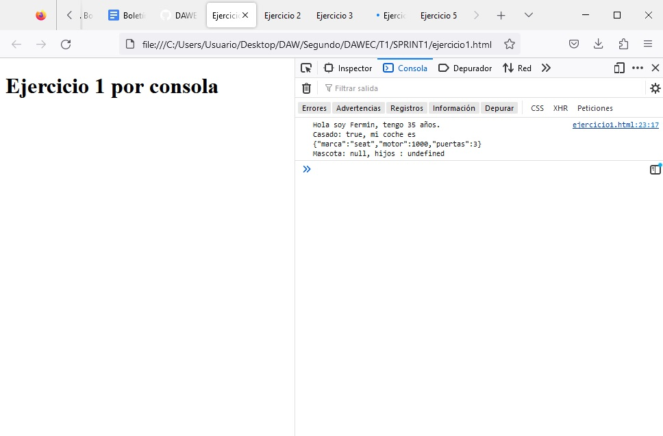

# SPRINT 1 
---
## JAVASCRIPT BASICO  
 

:mag: Analisis del problema.
---
>Tenemos que resolver una serie de ejercicios atraves de la consola del navegador y otro de forma interactiva con popup.

 

九勇뀫iseño de la solucion.
---
>Lo primero sera crear un repositorio en Github como nos ha indicado el profesor, hacerlo privado y añadirle como colaborador. Despues crear la estructura de carpetas como ha indicado. Y por ultimo ir subiendo a git todos los documentos

 

📝 Implementación de la solución.
---

>Crearemos un documento HTML por cada ejecicio (5 documentos) que estaran dentro de la carpeta SPRINT1.
Realizaremos capturas de los ejercicios estaticos y videos de los ejercicios que sean dinamicos en formato .gif para comprobar su correcto funcionamiento. Como son ejercicos tan basicos cargaremos el 'script' dentro del documento HTML ya que los resultados se mostraran por consola, exeptuando el ejercicio 4 que se mostraran diferentes popups.
En el documento insertaremos un texto indicando en que ejercicio estamos.

 

✅Pruebas
---

**Ejercicio 1:**

 

**Ejercicio 2:**

 

**Ejercicio 3:**

 

**Ejercicio 4:**

 

**Ejercicio 5:**

