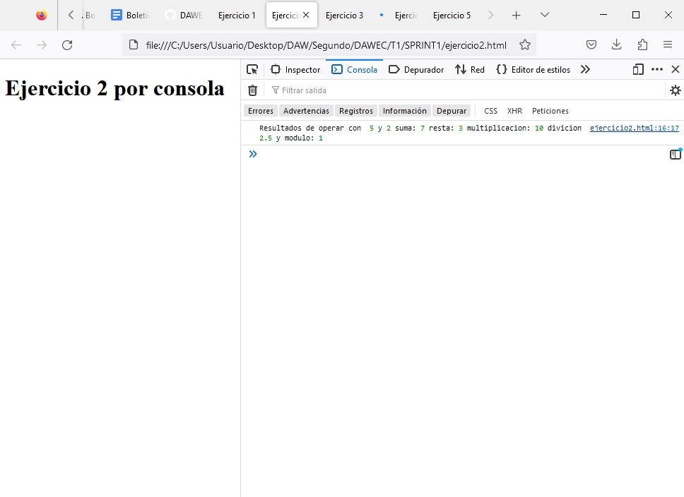
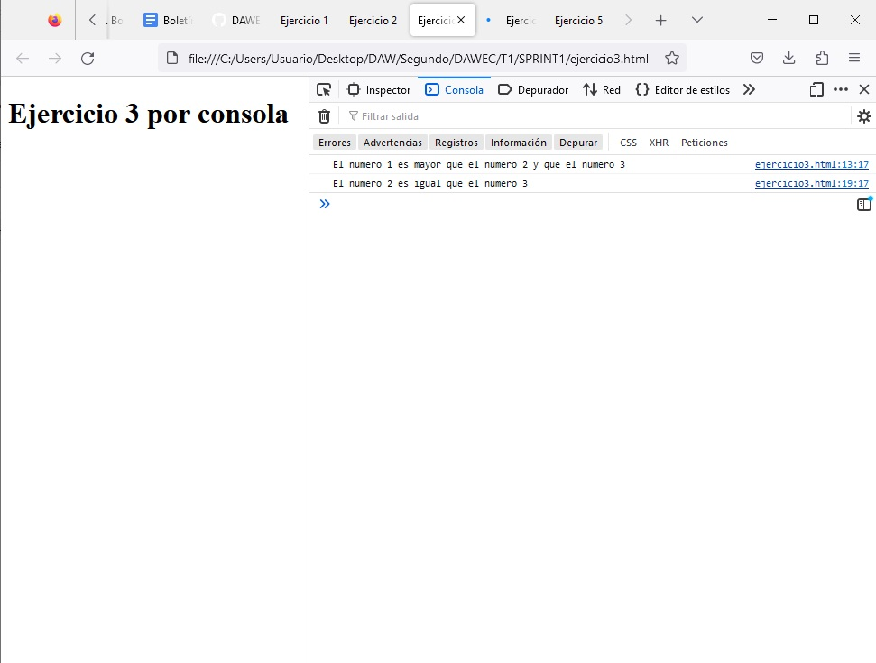

# SPRINT 1 
---
## JAVASCRIPT BASICO  
 

:mag: Analisis del problema.
---
‚Üí **Tenemos que resolver los siguientes ejercicios:**

>:one: Declaración y Tipos de Datos
Objetivo: Familiarizarse con la declaración de variables y la identificación de tipos de datos.
Declara una variable para cada tipo de dato: Number, String, Boolean, Object, Null y Undefined.
Utiliza console.log para mostrar el valor y el tipo de cada variable. 

>:two: Operaciones Aritméticas
Objetivo: Realizar operaciones aritméticas básicas.
Declara dos variables numéricas.
Realiza y muestra en la consola las operaciones de suma, resta, multiplicación, división y módulo entre estas variables.

>:three: Comparaciones
Objetivo: Comprender los operadores de comparación y cómo funcionan.
Declara tres variables con diferentes valores.
Utiliza operadores de comparación para comparar estas variables entre sí y muestra los resultados en la consola.

>:four: Estructuras Condicionales
Objetivo: Implementar estructuras condicionales para controlar el flujo del programa.
Escribir un programa que tome un n√∫mero como entrada.
Si el n√∫mero es mayor que 10, mostrar un mensaje indicando que es mayor. Si es menor, mostrar otro mensaje. Si es exactamente 10, mostrar un mensaje indicativo. (alert)

>:five: Bucles
Objetivo: Implementar bucles para repetir acciones m√∫ltiples veces.
Escribir un bucle que muestre en la consola los n√∫meros del 1 al 10.
Modificar el bucle anterior para mostrar solo los n√∫meros pares entre 1 y 10.  

 

✏️Diseño de la solucion.
---
>Lo primero sera crear un repositorio en Github como nos ha indicado el profesor, hacerlo privado y añadirle como colaborador. Despues crear la estructura de carpetas como ha indicado. Y por ultimo ir subiendo a git todos los documentos

 

📝 Implementación de la solución.
---

>Crearemos un documento HTML por cada ejecicio (5 documentos) que estaran dentro de la carpeta SPRINT1.
Realizaremos capturas de los ejercicios estaticos y videos de los ejercicios que sean dinamicos en formato .gif para comprobar su correcto funcionamiento. Como son ejercicos tan basicos cargaremos el 'script' dentro del documento HTML ya que los resultados se mostraran por consola, exeptuando el ejercicio 4 que se mostraran diferentes popups.
En el documento insertaremos un texto indicando en que ejercicio estamos.

 

‚úÖPruebas
---

**Ejercicio 1:**

 

**Ejercicio 2:**

 

**Ejercicio 3:**

 

**Ejercicio 4:**

 

**Ejercicio 5:**

