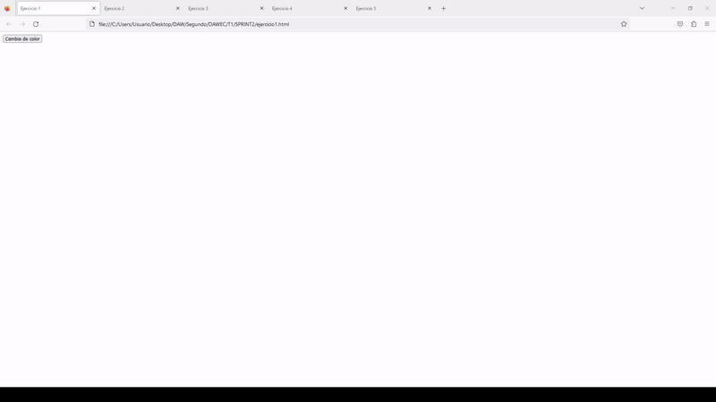
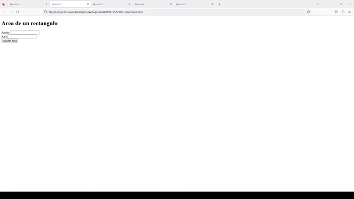
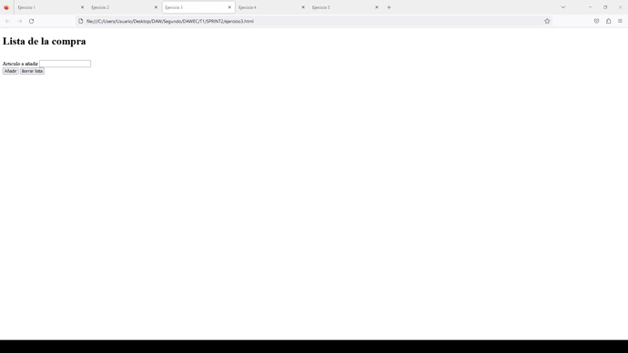
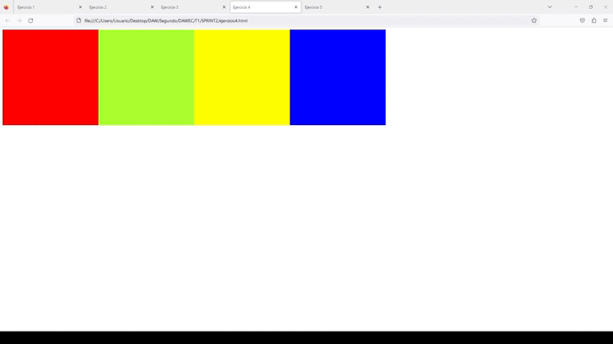
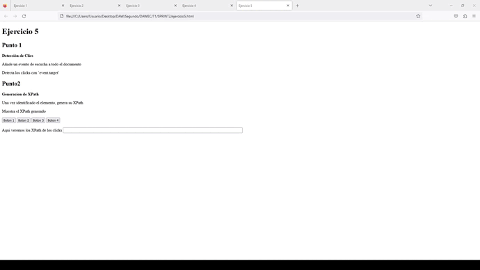

# SPRINT 2
---
## JAVASCRIPT   Funciones y eventos 
 

:mag: Analisis del problema.
---
>Tenemos que resolver una serie de ejercicios en los que la solucion se mostrara de forma grafica o visible en el mismo documento, en este SPRINT al contrario que en el anterior, no se mostraran los resultados por consola o en.

 

✏️Diseño de la solucion.
---
>Lo primero sera crear un la estructura del SPRINT 2 que seran 5 documentos HTML, uno por cada ejercicio mas el README correspondiente a cada SPRINT. Luego procedemos a solucionar cada uno de los ejercicios correspontientes con los script dentro del mismo documento HTML ya que son ejercicios cortos que no requieren demasiado codigo. 

 

📝 Implementación de la solución.
---

>Realizaremos un video por cada uno de los ejercicios con el formato .gif en el que se muestre el resultado esperado. 

 

✅Pruebas
---

**Ejercicio 1:** cambia el fondo de color.

**Ejercicio 2:** calcula el area de un rectangulo.

**Ejercicio 3:** Lista de la compra.

**Ejercicio 4:** cambia colores de elementos con 'mouseover' y restablece con 'mouseout'. 

**Ejercicio 5:** recoge el XPath de cada elemento que se cliquea

