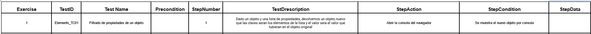
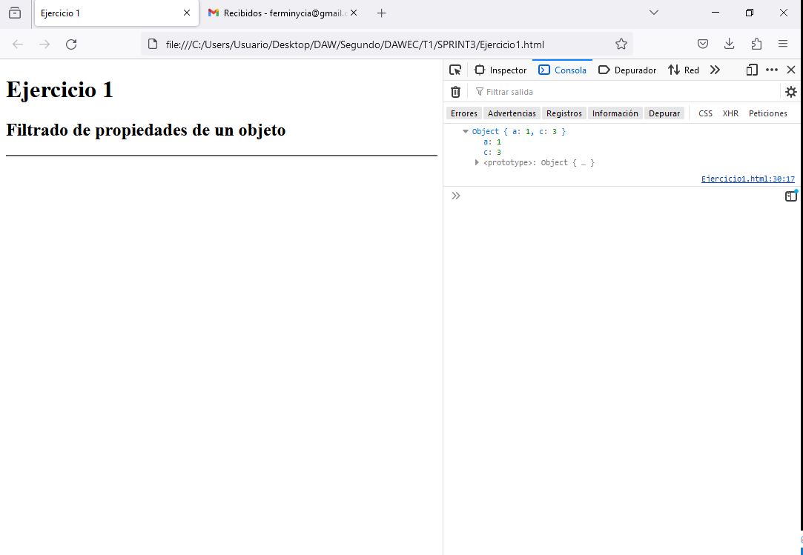
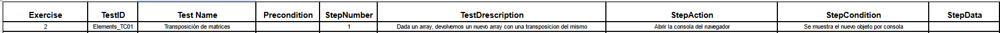
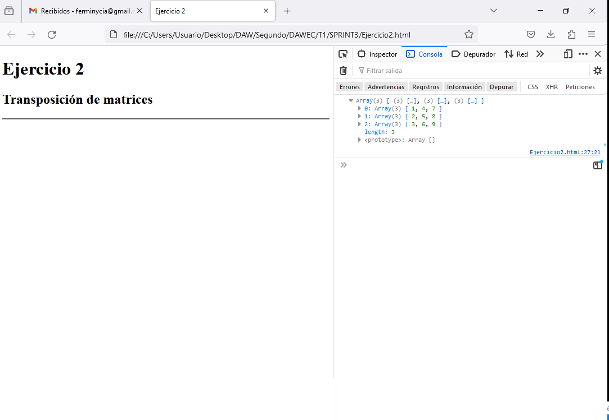
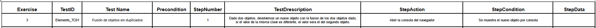
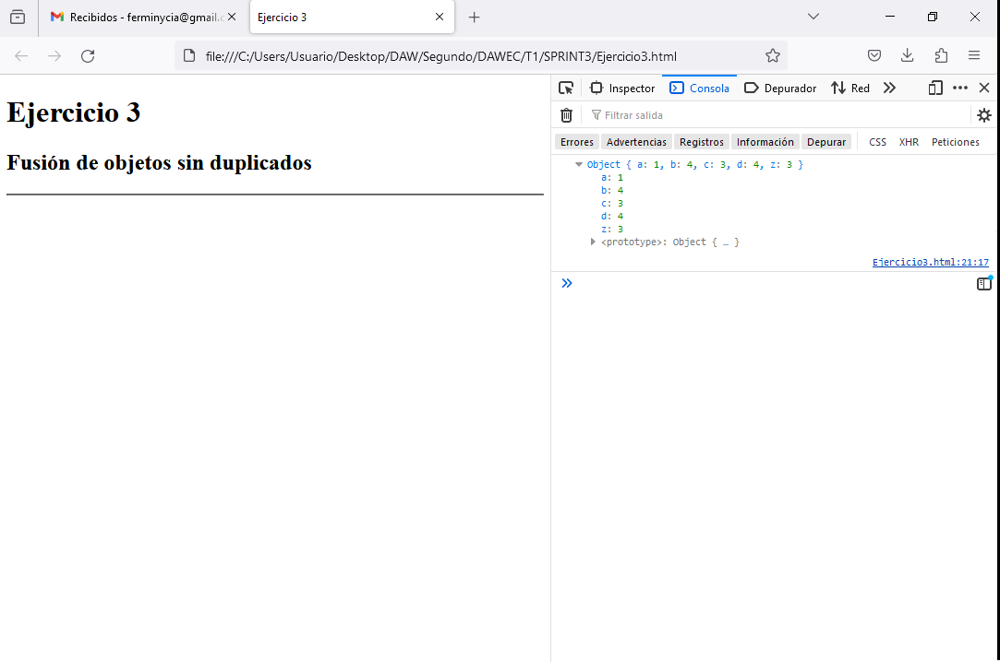
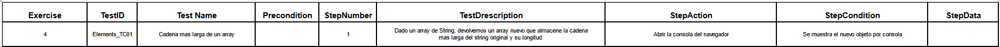
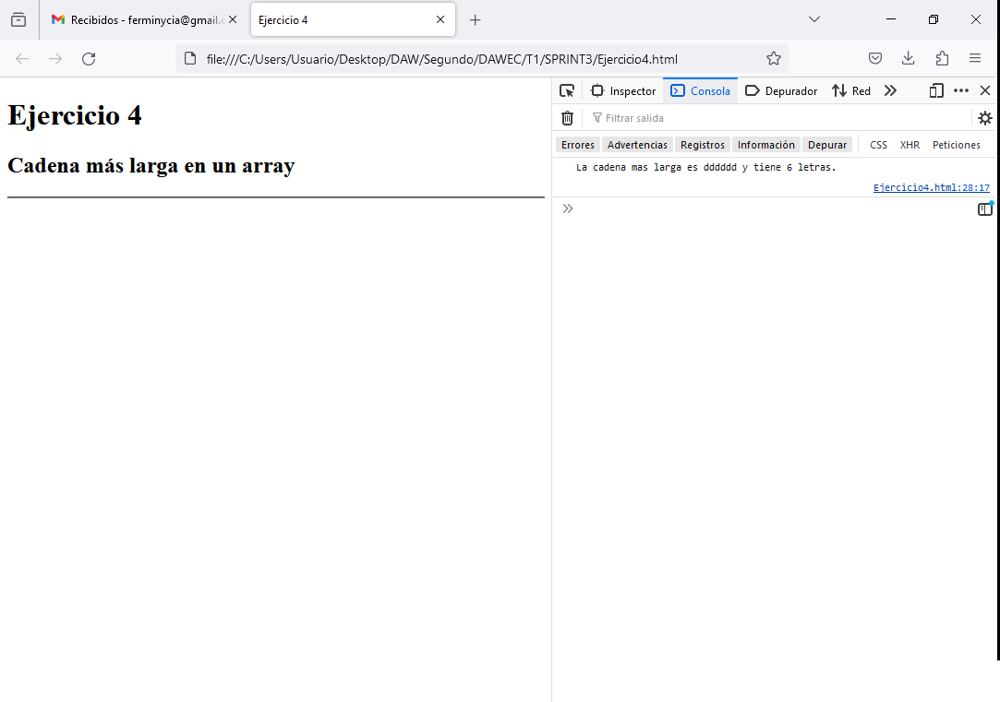
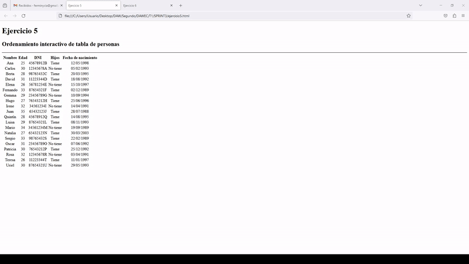
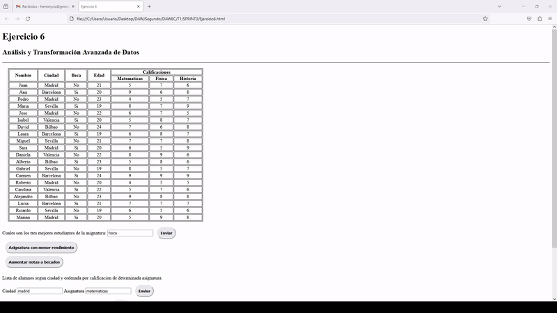

# SPRINT 3
---
## JAVASCRIPT   

:mag: Análisis del problema.
---
>En este sprint debemos resolver 6 ejercicios, de los cuales los 4 primeros son estáticos y el resultado los mostraremos por la consola del navegador y los dos últimos son dinámicos y se mostrarán los resultados en el mismo documento HTML.

 

✏️Diseño de la solución.
---
>Crearemos los archivos necesarios, que serán 6 documentos HTML y 2 archivos Javascript vinculados a sus correspondientes HTML. En los 4 primeros ejercicios los script estarán dentro del mismo documento HTML ya que son ejercicios simples que se resolverán por consola. Los dos últimos son algo más complicados y disponen de un JS vinculado al HTML.

 

📝 Implementación de la solución.
---
>Realizaremos una captura de pantalla del navegador por cada ejercicio del 1 al 4 ya que son estáticos y el resultado se mostrará mediante la consola del navegador. Y haremos un video en formato gif de los ejercicios 5 y 6 ya que son dinámicos.
En todos ellos se implementaran los test correspondientes.
 

✅Pruebas
---

**Ejercicio 1:** 

**Ejercicio 2:** 

**Ejercicio 3:** 

**Ejercicio 4:** 

**Ejercicio 5:** 

**Ejercicio 6:** 

