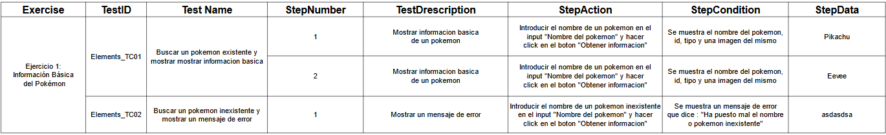
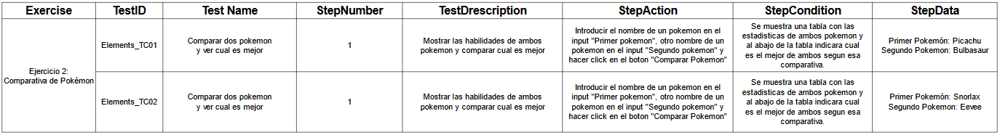
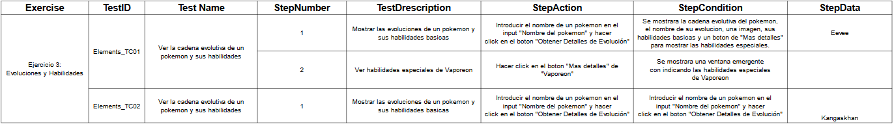
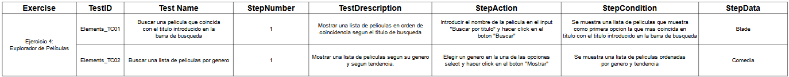
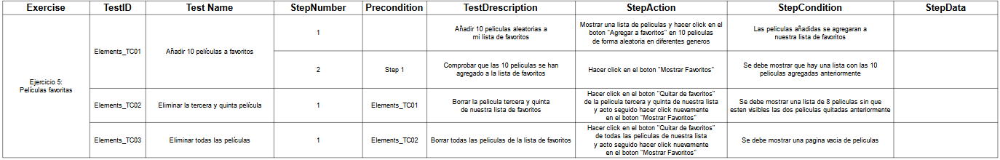

# SPRINT 4
---
## JAVASCRIPT   
 

:mag: Analisis del problema.
---
> En el transcurso de este cuarto sprint, nos proponemos abordar la resolución de cinco ejercicios de manera dinámica, buscando lograr un resultado visible en cada iteración.

 

✏️Diseño de la solucion.
---
> Generaremos cinco archivos con formato HTML5, y en los ejercicios que así lo requieran para facilitar su manejo, desarrollaremos también archivos CSS y JS vinculados de manera correspondiente al HTML5 (en los ejercicios 4 y 5). Cabe destacar que los documentos estarán rigurosamente estructurados tanto en su formato como en su organización, asegurando así una presentación coherente y una navegabilidad eficiente.

 

📝 Implementación de la solución.
---

> Produciremos un video para cada ejercicio, dado que estos presentan un carácter dinámico y requieren la interacción activa del usuario en los cinco ejercicios programados. Cabe destacar que este enfoque se basa en un plan de pruebas adjunto, el cual guía la secuencia y la evaluación de cada actividad de manera sistemática, garantizando así una implementación coherente y efectiva de los ejercicios propuestos.

 

✅Pruebas
---

**Ejercicio 1:**

**Ejercicio 2:** 

**Ejercicio 3:** 

**Ejercicio 4:** 

**Ejercicio 5:** 

