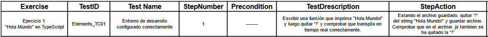
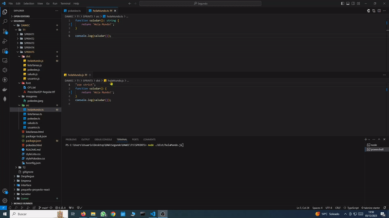
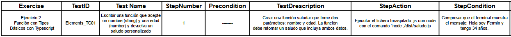
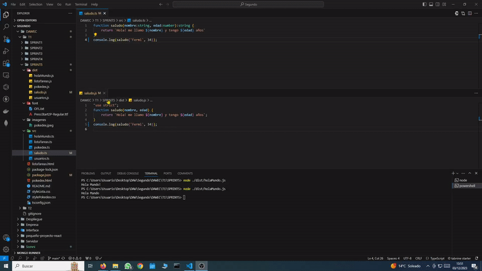
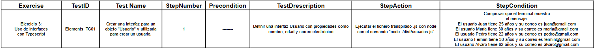
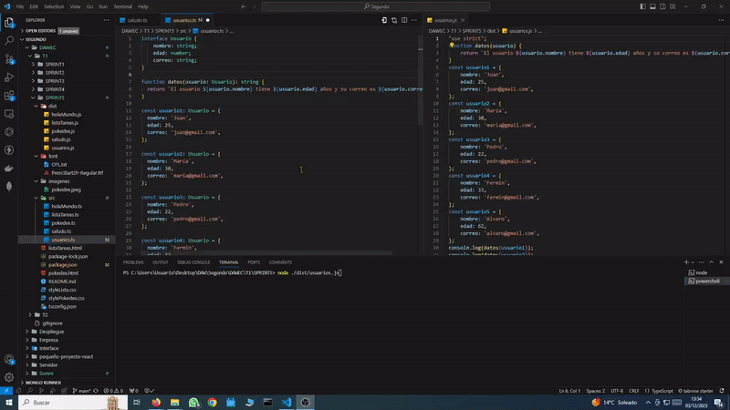
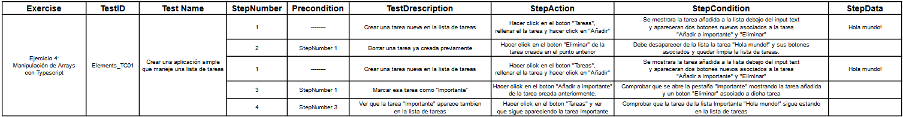
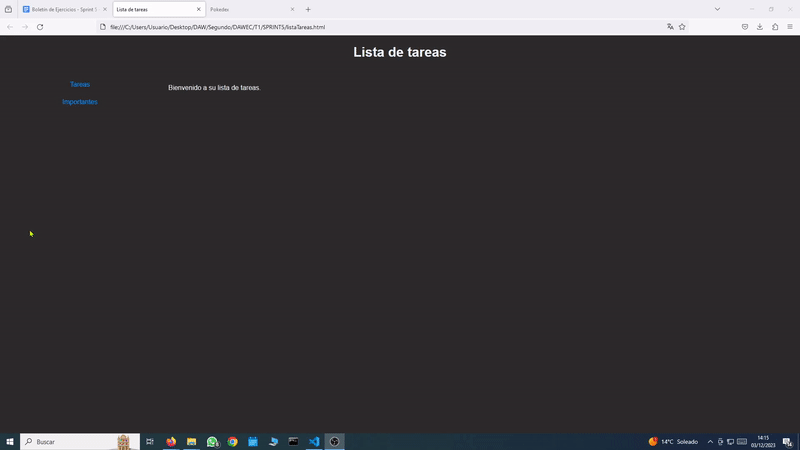
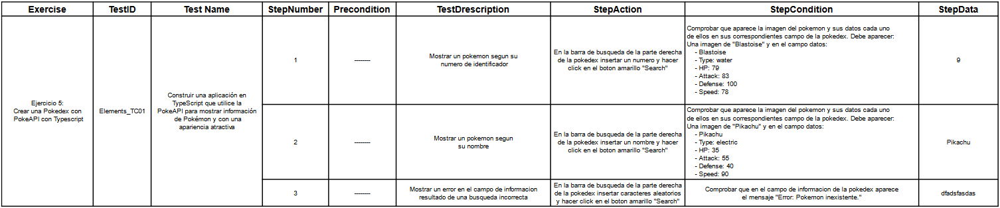
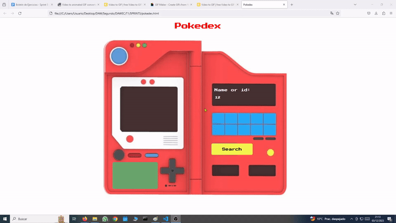

# SPRINT 5
---
## TypeScript   
 

🕵️‍♂️ Trabajo de investigacion sobre TypeScript
---
JAVASCRIPT  VS  TYPESCRIPT
>**Sistema de Tipos:**
JavaScript: Tipado dinámico **VS** TypeScript: Tipado estático opcional

>**Compilación:**
JavaScript: Interpretado **VS** TypeScript: Requiere transpilacion.

>**Extensiones de Archivo:**
JavaScript: .js **VS** TypeScript: .ts.

>**Tipado:**
JavaScript: Implícito y dinámico **VS** TypeScript: Explícito y estático.

>**Orientación a Objetos:**
JavaScript: Prototipos **VS** TypeScript: Clases, interfaces y herencia.

>**Compatibilidad con ECMAScript:**
JavaScript: Especificación de versión **VS** TypeScript: Especificación de versión de destino.

>**Decoradores:**
JavaScript: No nativo **VS** TypeScript: Soporte nativo.

>**Null y Undefined:**
JavaScript: null y undefined **VS** TypeScript: Tipos null y undefined.

>**Strict Null Checking:**
JavaScript: No aplicable **VS** TypeScript: Verificación estricta de nulos opcional.

>**Herramientas de Desarrollo:**
JavaScript: Herramientas estándar del entorno **VS** TypeScript: Herramientas adicionales de desarrollo.

**JavaScript**

>**Ventajas:**
**Facilidad de Uso:** Fácil de aprender y comenzar a programar.
Ubicuidad: Ampliamente compatible y ejecutado en todos los navegadores.
**Flexibilidad:** Tipado dinámico permite un desarrollo rápido.

>**Inconvenientes:**
**Errores en Tiempo de Ejecución:** Los errores de tipo pueden aparecer durante la ejecución.
**Menor Escalabilidad:** Puede ser menos adecuado para proyectos grandes y complejos.
**Menor Mantenibilidad:** La falta de tipos puede dificultar el mantenimiento.

**TypeScript:**

>**Ventajas:**
**Tipado Estático:** Detecta errores en tiempo de compilación, mejorando la calidad del código.
**Mejor Mantenibilidad:** El sistema de tipos facilita la comprensión y el mantenimiento del código.
**Desarrollo Escalable:** Adecuado para proyectos grandes y equipos colaborativos.

>**Inconvenientes:**
**Curva de Aprendizaje:** Puede requerir tiempo adicional para acostumbrarse al sistema de tipos.
**Necesidad de Compilación:** Requiere un paso de compilación antes de la ejecución.
**Sobrecarga de Tipos:** Puede resultar en una mayor cantidad de código debido a las declaraciones de tipos.
 

Como manual de configuracion de Typescript podemos consultar la siguiente documentacion:
https://developer.mozilla.org/en-US/docs/Learn/Tools_and_testing/Client-side_JavaScript_frameworks/Svelte_TypeScript

:mag: Analisis del problema.
---
>En el transcurso de este quinto sprint, nos proponemos abordar la resolución de cinco ejercicios desarrollados en Typescript, los 3 primeros seran estaticos y mostraran su resultado por consola. Los dos siguientes seran dinamicos lo cual tendremos que interactuar con ellos.
 

✏️Diseño de la solucion.
---
>Generaremos cinco ficheros con formato TypeScript en la ruta del proyecto /src. El transpilador configurado previamente creara la ruta /dist y almacenara en ella los ficheros .js.
Luego ejecutaremos los tres primeros mediante node en el terminal y los dos restantes mediante un archivo HTML con sus correspondientes ficheros vinculados de CSS y JS.

 

📝 Implementación de la solución.
---

>Produciremos un video para cada ejercicio, aunque tres de ellos sean estaticos, el video mostrara la correcta transpilacion en tiempo real y su ejecucion mediante el terminal.Cabe destacar que este enfoque se basa en un plan de pruebas adjunto, el cual guía la secuencia y la evaluación de cada actividad de manera sistemática, garantizando así una implementación coherente y efectiva de los ejercicios propuestos.

 

✅Pruebas
---

**Ejercicio 1:**

**Ejercicio 2:** 

**Ejercicio 3:** 

**Ejercicio 4:** 

**Ejercicio 5:** 

