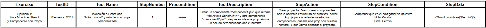
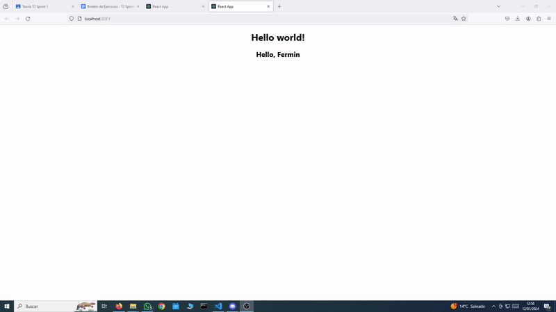
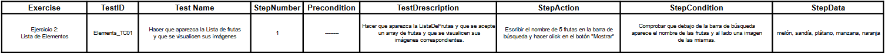
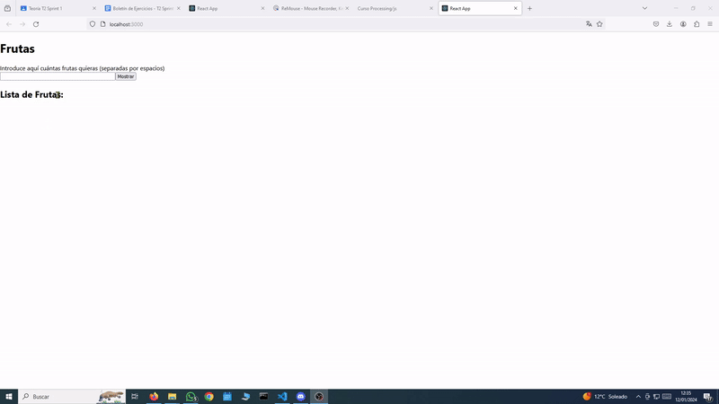
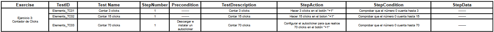
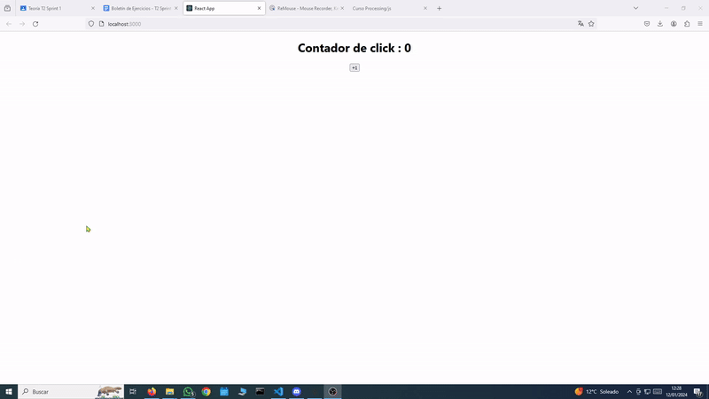
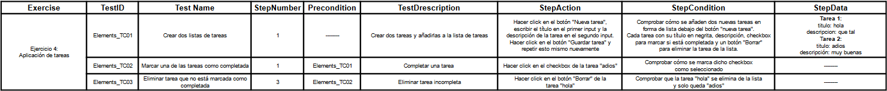
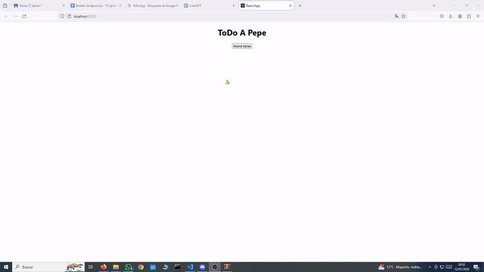
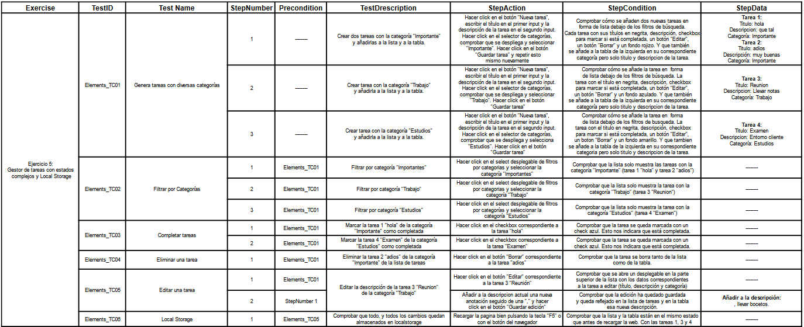
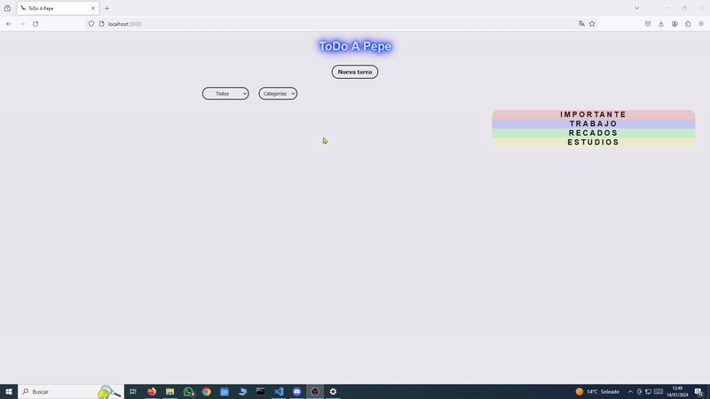

# SPRINT 1

---
## React   

 

🕵️‍♂️ Comparativa entre React Vs Angular
---

>#### Lenguaje:
>**React:** Utiliza JavaScript (también JSX).
>**Angular:** Utiliza TypeScript (superset de JavaScript).

 

>#### Arquitectura:
>**React:** Es una biblioteca para construir interfaces de usuario.
>**Angular:** Es un framework MVC (Model-View-Controller) completo.

 

>#### Tamaño:
>**React:** Más liviano y flexible, el desarrollador decide las bibliotecas adicionales.
>**Angular:** Mayor tamaño debido a su estructura más completa.

 

>#### DOM Virtual:
>**React:** Utiliza un DOM virtual para optimizar las actualizaciones del DOM.
>**Angular:** Utiliza un DOM virtual incorporado.

 

>#### Sintaxis:
>**React:** Más sencilla y basada en JavaScript.
>**Angular:** Más declarativa y basada en TypeScript.

 
    
>#### Curva de Aprendizaje:
>**React:** Menos empinada.
>**Angular:** Mayor, ya que es un framework más completo.

 

>#### Flexibilidad:
>**React:** Permite elegir herramientas adicionales y bibliotecas.
>**Angular:** Menos flexible, pero proporciona un conjunto integrado de herramientas.

 

>#### Rendimiento:
>**React:** Mayor control sobre el rendimiento.
>**Angular:** Mayor cantidad de abstracciones puede afectar el rendimiento.

 

>#### Comunidad:
>**React:** Gran comunidad y ecosistema.
>**Angular:** Comunidad sólida respaldada por Google.

 

>#### Empresas que lo Utilizan:
>**React:** Facebook, Instagram, Airbnb.
>**Angular:** Google, Microsoft, IBM.

 

>###Ventajas e inconvenientes de React:
>**Ventajas:**
>Flexibilidad y libertad de elección.
>Buena integración con otras bibliotecas y frameworks.
>Gran comunidad y recursos disponibles.
>
>**Inconvenientes:**
>Mayor responsabilidad en la toma de decisiones.
>Necesidad de elegir herramientas adicionales.

>#### Ventajas e inconvenientes de Angular:
>**Ventajas:**
>Estructura más completa y opinionada.
>TypeScript proporciona verificación de tipos.
>Mayor consistencia en grandes proyectos.
>
>**Inconvenientes:**
>Mayor curva de aprendizaje.
>Mayor tamaño y complejidad en proyectos pequeños.

:mag: Analisis del problema.
---

>En el transcurso de este primer sprint del segundo trimestre, nos proponemos abordar la resolución de cinco ejercicios desarrollados cada uno de ellos como proyectos independientes de React, el primero sera un ejercicio estatico (hola mundo y saludo personalizado con props) y mostrara su resultado en el navegador de manera estatica. Los cuatro siguientes seran dinamicos, con lo cual tendremos que interactuar con ellos mediante botones, desplegables o introduciendo textos.
 

✏️Diseño de la solucion.
---

>Para cada uno de los 5 ejercicios, generaremos un proyecto React utilizando el comando "npx create-react-app ejercicioX". A continuación, configuraremos la estructura de carpetas añadiendo las rutas components y resources para organizar los elementos de manera clara. 
>
>Dentro de la carpeta components, crearemos los componentes necesarios para cada ejercicio con la extencion .jsx. Cada componente será exportado desde su respectivo archivo para facilitar la importación en otros componentes. 
>
>En el archivo App.js, importaremos y utilizarémos los componentes necesarios para cada ejercicio. En particular, en el ejercicio 1, haremos uso de props para la comunicación entre componentes.
>
>Este enfoque modular y organizado nos permitirá mantener un código limpio y fácil de mantener a medida que avanzamos en cada ejercicio del proyecto.
 

📝 Implementación de la solución.
---

>La implementación de la solución incluirá la creación de un video para cada ejercicio, siguiendo el plan de pruebas para validar el correcto funcionamiento de los proyectos. En el ejercicio 5 (Lista de Tareas), se utilizará localStorage del navegador para garantizar la persistencia de datos localmente. Además, se realizará el despliegue en Azure, asegurando que la aplicación pueda ser utilizada en cualquier PC sin perder las listas de tareas almacenadas localmente. (https://fermintestapp.azurewebsites.net)

 

✅Pruebas
---

#### Ejercicio 1:

#### Ejercicio 2: 

#### Ejercicio 3:

#### Ejercicio 4:

#### Ejercicio 5:

