

# SPRINT 2

---
## React   

 

:mag: Analisis del problema.
---

>En esta tarea, abordaremos cinco ejercicios de manera dinámica. Cada ejercicio será sometido a pruebas exhaustivas que se detallarán en el último punto del informe. Se presentará un video que demostrará la ejecución de los ejercicios y se proporcionará un plan de pruebas detallado para evaluar la funcionalidad y robustez de cada solución. Este enfoque garantizará una comprensión completa y una evaluación rigurosa de cada ejercicio.
 

✏️Diseño de la solucion.
---

>Para cada uno de los 5 ejercicios, generaremos un proyecto React utilizando el comando "npx create-react-app ejercicioX". A continuación, configuraremos la estructura de carpetas añadiendo las rutas components y resources para organizar los elementos de manera clara. 
>
>Dentro de la carpeta components, crearemos los componentes necesarios para cada ejercicio con la extencion ".jsx". Cada componente será exportado desde su respectivo archivo para facilitar la importación en otros componentes o en la propia App. 
>
>En el archivo App.js, importaremos y utilizarémos los componentes necesarios para cada ejercicio.
>
>Este enfoque modular y organizado nos permitirá mantener un código limpio y fácil de mantener a medida que avanzamos en cada ejercicio del proyecto.
 

📝 Implementación de la solución.
---

>La implementación de la solución incluirá la creación de un video para cada ejercicio, siguiendo el plan de pruebas para validar el correcto funcionamiento de los proyectos. En el ejercicio 5 (Lista de Tareas), se utilizará localStorage del navegador para garantizar la persistencia de datos localmente. Además, se realizará el despliegue en Azure, asegurando que la aplicación pueda ser utilizada en cualquier PC sin perder las listas de tareas almacenadas localmente. (https://fermintestapp.azurewebsites.net)

 

✅Pruebas
---

#### Ejercicio 1:

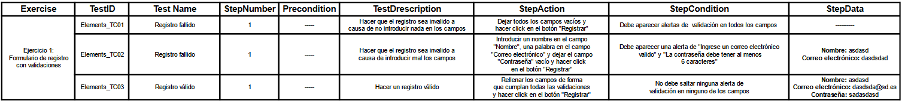
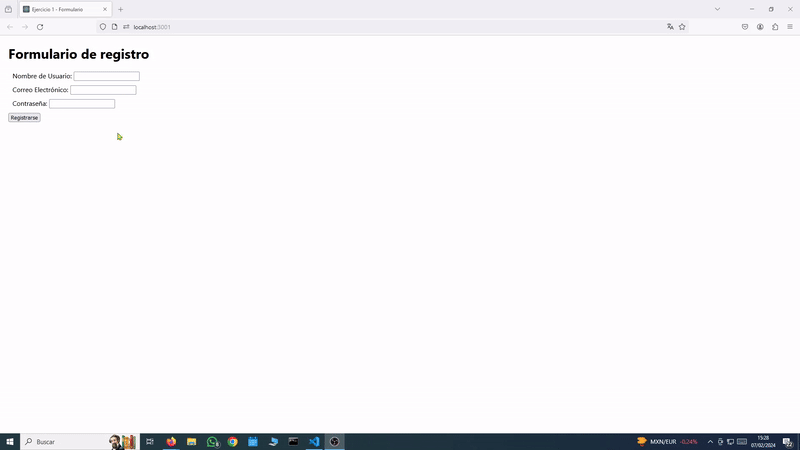

#### Ejercicio 2: 

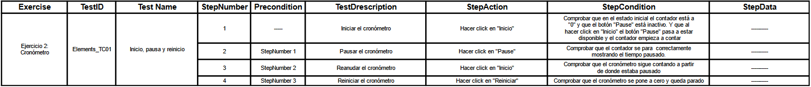
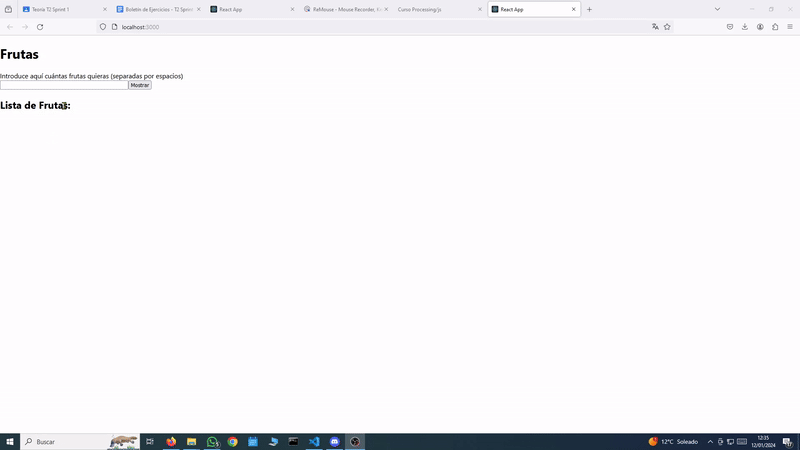

#### Ejercicio 3:
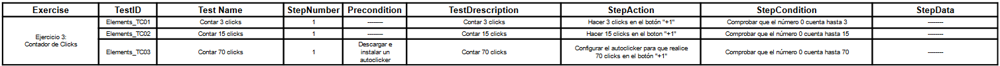
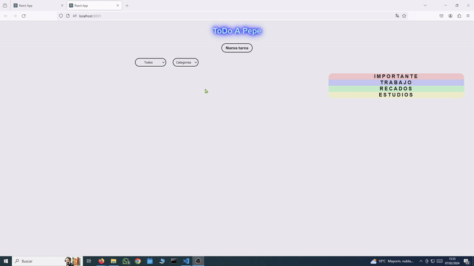
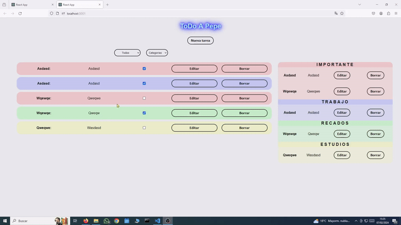

#### Ejercicio 4:

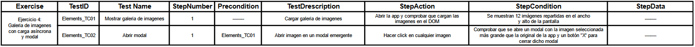
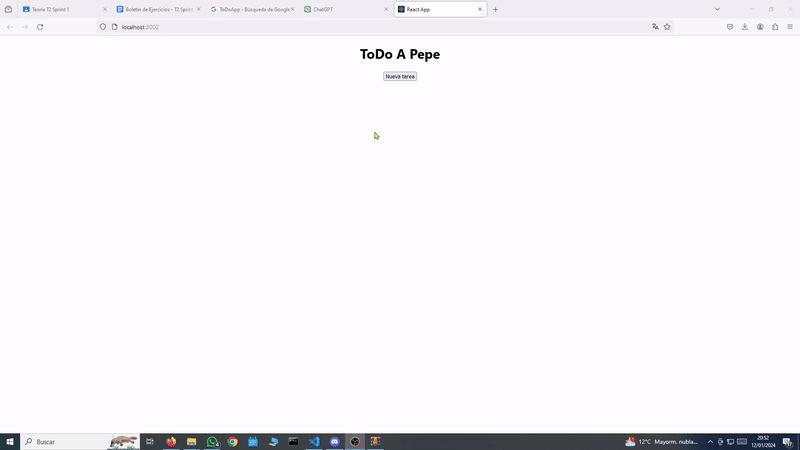

#### Ejercicio 5:

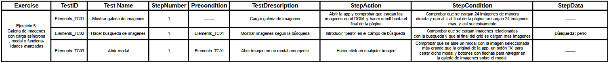
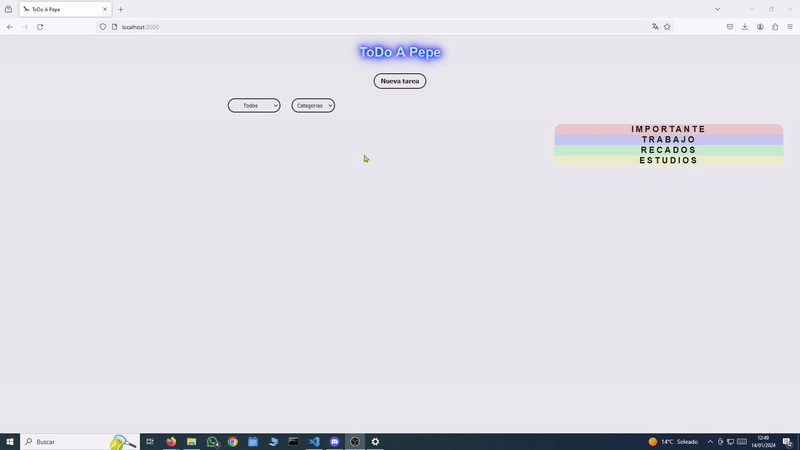