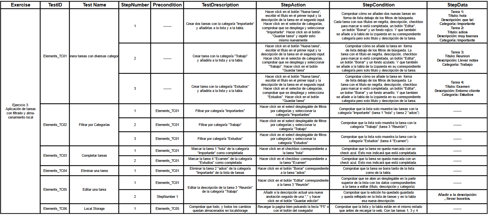

# SPRINT 2

---
## React   

 

:mag: Analisis del problema.
---

>En esta tarea, abordaremos cinco ejercicios de manera dinámica. Cada ejercicio será sometido a pruebas exhaustivas que se detallarán en el último punto del informe. Se presentará un video que demostrará la ejecución de los ejercicios y se proporcionará un plan de pruebas detallado para evaluar la funcionalidad y robustez de cada solución. Este enfoque garantizará una comprensión completa y una evaluación rigurosa de cada ejercicio.
 

九勇뀫iseño de la solucion.
---

>Para cada uno de los 5 ejercicios, generaremos un proyecto React utilizando el comando "npx create-react-app ejercicioX". A continuación, configuraremos la estructura de carpetas añadiendo las rutas components y resources para organizar los elementos de manera clara. 
>
>Dentro de la carpeta components, crearemos los componentes necesarios para cada ejercicio con la extencion ".jsx". Cada componente será exportado desde su respectivo archivo para facilitar la importación en otros componentes o en la propia App. 
>
>En el archivo App.js, importaremos y utilizarémos los componentes necesarios para cada ejercicio.
>
>Este enfoque modular y organizado nos permitirá mantener un código limpio y fácil de mantener a medida que avanzamos en cada ejercicio del proyecto.
 

📝 Implementación de la solución.
---

>En este punto, detallaremos la implementación de cada ejercicio:

    Ejercicio 1: formulario de registro con validaciones:
        Se desarrollará un formulario de registro con campos validados.
        Se aplicarán validaciones en cada campo para garantizar la entrada de datos correcta.

    Ejercicio 2: cronómetro con funcionalidades avanzadas:
        Se creará un cronómetro con opciones de inicio, pausa y reinicio.
        Se incluirá un modo de entrenamiento de boxeo o series, con intervalos de 2 minutos 
        de ejercicio y 30 segundos de descanso.
        Sonarán alarmas distintas para indicar los momentos de descanso y actividad.

    Ejercicio 3: lista de tareas con Local Storage (Componentes de Clase):
        Desarrollo de una lista de tareas que utilizará Local Storage para almacenar datos.
        Implementación mediante componentes de clase.

    Ejercicio 4: galería de Imágenes con Modal Emergente:
        Creación de una galería de imágenes con un modal que se activará al hacer clic en una 
        imagen.

    Ejercicio 5: galería de imágenes con barra de búsqueda y paginación:
        Extensión de la galería de imágenes con una barra de búsqueda y un grid que carga 
        más imágenes al llegar al final.
        Integración de un modal que permite navegar entre imágenes y se cerrará con la tecla "ESC".

Esta implementación se llevará a cabo de manera dinámica, y cada ejercicio será sometido a pruebas exhaustivas para garantizar su correcto funcionamiento y la satisfacción de los requerimientos específicos de cada uno. El proceso completo se mostrará en un video que incluirá un plan de pruebas detallado.

 

✅Pruebas
---

#### Ejercicio 1:

#### Ejercicio 2: 

#### Ejercicio 3:

#### Ejercicio 4:

#### Ejercicio 5:

